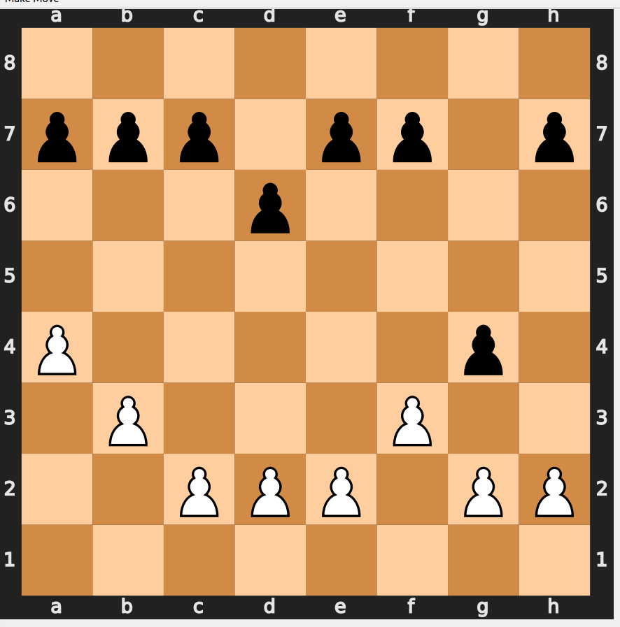
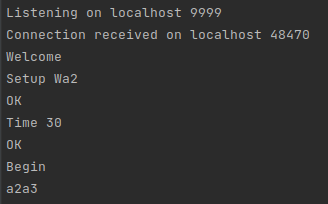

# Two Flags Agent

- [Full report and executable](report/Report.md) 

We present AI agent playing "two flags", as well as an interface for playing the game.

*Developers: Daniel Yakovlev and Daniel Greenhut*

## The Game



- The two flags game includes 8 black pawns and 8 white pawns.
- At the beginning, each pawn is placed in a same way as in chess.
- Moving is completely identical to chess.
- The white player wins when either:

    1. one pawn reaches the first row
    2. black player has no pawns left
    3. back player cannot make a move
- A winning of the black player is symmetric.

## Running

Before running make sure to ```pip install -r requirements.txt``` on a python3.9 environment.

To play, run ```python Game.py```.

##Arguments

Default arguments will execute a game against a server, according to the protocol below.

```--agent random/minimax/alphabeta/best``` To change the agent type. Default is best.

```--color B/W``` To set the color of the agent.

```--server 1/0``` To decide if playing against server. if not  please set:

```--human 1/0``` To decide if playing against a human player or another agent:

```--agent2 random/minimax/alphabeta/best``` To change the second agent type.

```--ip``` and ```--port``` to define hostname and port if playing against server. 
The default is *localhost 9999*.

```--fen``` to change the initial state according the common chess [FEN convention](https://www.chess.com/terms/fen-chess).

```--pt 1/0``` if true, times of each ply will be printed.

When playing against human or second agent, it is necessary to push the *Make move* button
to perform a full move (2 plys) and if human is playing, put the desired move in the console.


## Server Protocol

- After connection, server should send ```Welcome``` message.
- Then it is possible to set the game time by ```Time X``` message (in minutes), 
where the default is 15.
- Wait for ```OK``` message.
- Then it is possible to set the initial board state by ```Setup ``` message (in minutes), 
where the default is as described above.
- Wait for ```OK``` message.
- Then, it is possible to start by making a white move, or letting the agent making a white 
move by ```Begin``` message. In this way the colores will be set for the agent and the server.

Example:



[Linux executable](https://drive.google.com/file/d/1jovYaGXtJ-t1b8nJucoKT8gqWz0Pr03B/view) 
with default arguments.